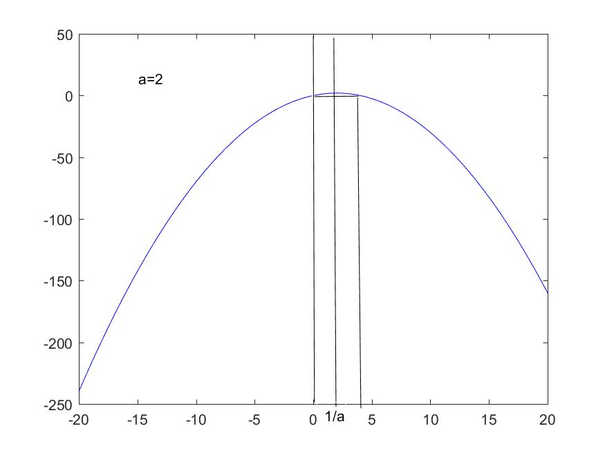
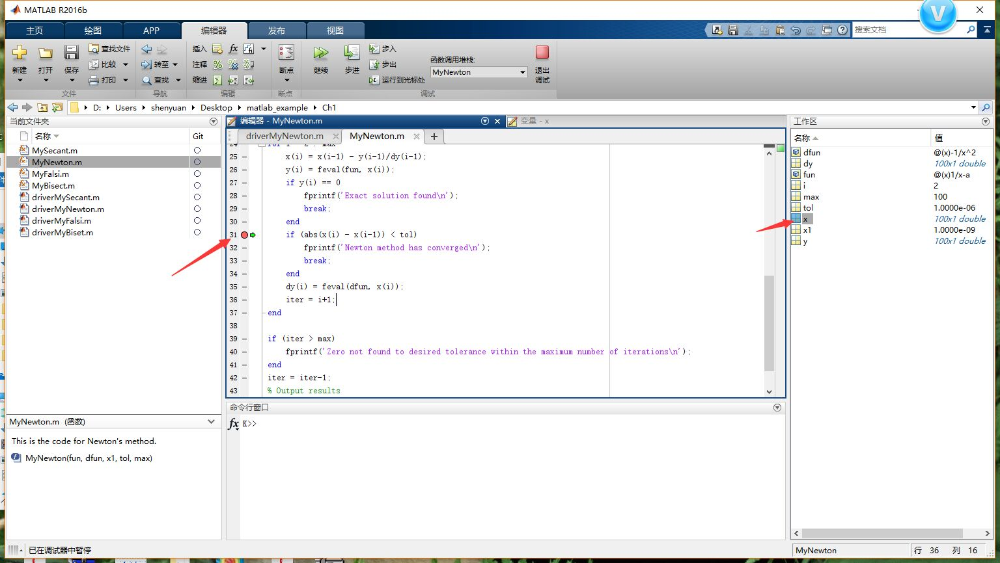

#### p30:

8. Consider again the function $f(x) = 1/x - a$ from problem 4. Using $x_0=10^{-10}$, how many iterations are needed to get six decimal place accuracy if $0.5$? Does this contradict the claimed rapid convergence?

   使用Newton迭代就相当于采用了$x = g(x)=x-\frac{f(x)}{f'(x)}$这样的不动点迭代格式$g'(x)=\frac{f(x)f''(x)}{(f'(x))^2}$,  对任意$x_0\in (0,1/a]$, $f(x_0)\ge0(x_0=1/a时),f'(x_0)<0$,即$f(x)$在$(0,1/a]$上单减，$g‘(x)>0$,说明

   一方面，$x_1 = x_0-f(x_0)/f'(x_0)>x_0$, 

   另一方面，由taylor展开有

   $f(x)=f(x_0)+f'(x_0)(x-x_0)+\frac{1}{2!}f''(\xi_0)(x-x_0)^2$, 其中$\xi_0$介于$x$和$x_0$之间.

   $x^*=1/a$是零点。

   利用$f(x^*)=0$得，$x^*=x_0-\frac{f(x_0)}{f'(x_0)}-\frac{1}{2}\frac{f''(\xi_0)}{f'(x_0)}(x^*-x_0)^2=x_1-\frac{1}{2}\frac{f''(\xi_0)}{f'(x_0)}(x^*-x_0)^2$,

由$f''(\xi_0)>0,f'(x_0)<0$,当$x\in(0,1/a)$, 则说明$x^*>x_1$, 从而就有

$x_0<x_1<x^*$

​       用数学归纳法，设$x_{k-1}<x_k<x^*$，则有$f(x_k)<0$, 从而$x_{k+1}=x_k-\frac{f{x_k}}{f'(x_k)}>x_k$,再由taylor展开式有

$f(x)=f(x_k)+f'(x_k)(x-x_k)+\frac{1}{2!}f''(\xi_k)(x-x_k)^2$, 其中$\xi_k$介于$x$和$x_k$之间.

利用$f(x^*)=0$得，$x^*=x_k-\frac{f(x_k)}{f'(x_k)}-\frac{1}{2}\frac{f''(\xi_k)}{f'(x_k)}(x^*-x_k)^2=x_{k+1}-\frac{1}{2}\frac{f''(\xi_k)}{f'(x_k)}(x^*-x_k)^2$,

由$f''(\xi_k)>0,f'(x_k)<0$,当$x\in(0,1/a)$, 则说明$x^*>x_{k+1}$, 从而就有

$x_k<x_{k+1}<x^*$,

从而数列$\{x_k\}$单调增加且有上界。由单调有界原理有，$\{x_k\}$有极限$l$, 对式$x_{k+1}=x_k-\frac{f(x_k)}{f'(x_k)}$取$k\rightarrow\infty$, 并利用$f,f'$的连续性知$f(l)=0$, 即$l=x^*=1/a$.

其实，画出$g(x)$ 的图像，可以很明显的看出原因：



若$x_0$的取值大于$2/a$, 则经过一次映射，$g(x_0)$的取值不能再回到$(0,1/a]$区间内，即不能到达不动点(若$x<0$, 则有$x_1=g(x_0)=x_0-f(x_0)/f'(x_0)<x_0$, 因此只会越来越小)。若$x_0$的取值等于$0 or 2/a$,则有$g(x_0)=0$,也就不可能找到$1/a$这个不动点。

所以只要初值的选取满足$x_0\in(0,2/a)$,则迭代可以收敛。


为什么给的程序不work了？

a = 0.5；

给如下代码,运行

```matlab
clear;
close all;
clc
a = 0.5;
x1 = 10e-10;
tol = 1e-6;
max = 100;
fun = @(x) 1/x-a;
dfun = @(x)-1/x^2;

[x, y] = MyNewton(fun, dfun, x1, tol, max);

function [x, y] = MyNewton(fun, dfun, x1, tol, max)

x = zeros(max, 1); 
y = zeros(max, 1);
dy = zeros(max, 1);

% Set an intial interval.
x(1) = x1;
y(1) = feval(fun, x(1));
dy(1) = feval(dfun, x(1));

% Newton search
for i = 2 : max
    x(i) = x(i-1) - y(i-1)/dy(i-1);
    y(i) = feval(fun, x(i));
    if y(i) == 0
        fprintf('Exact solution found\n'); 
        break;
    end
    if (abs(x(i) - x(i-1)) < tol)
        fprintf('Newton method has converged\n'); 
        break;
    end 
    dy(i) = feval(dfun, x(i));
    iter = i+1;
end

if (iter > max)
	fprintf('Zero not found to desired tolerance within the maximum number iterations\n');
end
iter = iter-1;
% Output results
k = 1:iter;
fprintf('     iter        x         y\n');
disp([k' x(1:iter) y(1:iter)]);
```

显示如下错误：

```matlab
Newton method has converged
未定义函数或变量 'iter'。

出错 MyNewton (line 39)
if (iter > max)

出错 driverMyNewton (line 22)
[x, y] = MyNewton(fun, dfun, x1, tol, max);
```

由错误提示可以定位到程序如下位置：

> ```matlab
>     if (abs(x(i) - x(i-1)) < tol)
>         fprintf('Newton method has converged\n'); 
>         break;
>     end 
> ```

和39行

> ```matlab
> if (iter > max)
> 	fprintf('Zero not found to desired tolerance within the maximum number iterations\n');
> end
> ```

可见在循环中是在上述break的位置跳出循环，并且是在第一次就跳出(因为有39行iter未定义的错误出现，所以可以判断程序未运行到iter出现的地方)。


为什么会从该处跳出循环?

因为满足了if设置的条件，说明`abs(x(i) - x(i-1)) < tol`满足，因此在相应的位置设置断点(就是在旁边的小短线上点一下)，



运行程序会在断点处停止，此时查看工作区中x的值，你会发现


确实满足了条件，但确实没有到达我们想要的值1/a, 说明我们的收敛准则有问题(上一步的x和这一步的x离得很近并不能说明算的好)，过去的收敛准则对这个问题已经不适用了，因此需要去修改我们对应的代码，思路主要有两条，第一是修改tol使其变的很小，使程序不会在上述位置跳出。另一个就是不用这条收敛准则，删除对应的代码。


下面说题目的要求6位小数精度，因为你已经知道了精确解，所以你可以直接用精确解和你所求解出的数作比较，满足要求则迭代停止，代码如下：

```matlab
clear;
close all;
clc
format shortE;
a = 0.5;
x1 = 1e-10;
tol = 1e-6;
max = 100;
fun = @(x) 1/x-a;
dfun = @(x)-1/x^2;

[x, y] = MyNewton(fun, dfun, x1, tol, max, a);

function [x, y] = MyNewton(fun, dfun, x1, tol, max, a)
% This is the code for Newton's method.
% Input:
% x1              Initial guess 
% fun             function
% dfun            derivative of the function
% tol             Allowable tolerance in computed zero
% max             Maximum number of iterations
% Output:
% x               Vector of approximations to zero
% y               Vector of function values, fun(x)

% Preallocate vectors.
x = zeros(max, 1); 
y = zeros(max, 1);
dy = zeros(max, 1);
rapid = zeros(max, 1);

% Set an intial interval.
x(1) = x1;
y(1) = feval(fun, x(1));
dy(1) = feval(dfun, x(1));

% Newton search
for i = 2 : max
    x(i) = x(i-1) - y(i-1)/dy(i-1);
    rapid(i) = abs(x(i)-1/a)/abs(x(i-1)-1/a)^2;
    y(i) = feval(fun, x(i));
    if y(i) == 0
        fprintf('Exact solution found\n'); 
        break;
    end
    if (abs(x(i) - 1/a) < tol)
        fprintf('Newton method has converged\n'); 
        break;
    end 
    dy(i) = feval(dfun, x(i));
    iter = i+1;
end

if (iter > max)
    fprintf('Zero not found to desired tolerance within the maximum number of iterations\n');
end
iter = iter-1;
% Output results
k = 1:iter;
fprintf('     iter        x         y      rapid\n');
disp([k' x(1:iter) y(1:iter) rapid(1:iter)]);
```

计算了收敛阶，可以发现收敛速度是合理的。