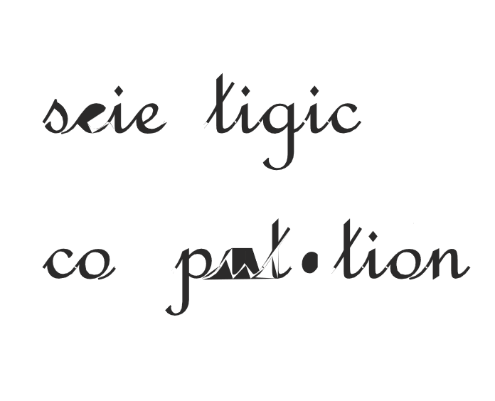

    

This is programs for Numerical Analysis and Scientific Computation, which use MIT license.If you are a student in QueenMary, I think you should do it by yourself. Because you have good start for learning programming, you have the ability to complete your work.I will submit some programs writtern by myself, which I can't guarnteen it is true. If you find an error, you can propose issue. You can also write some code and doc, then add to this repository. Many thanks to you!
